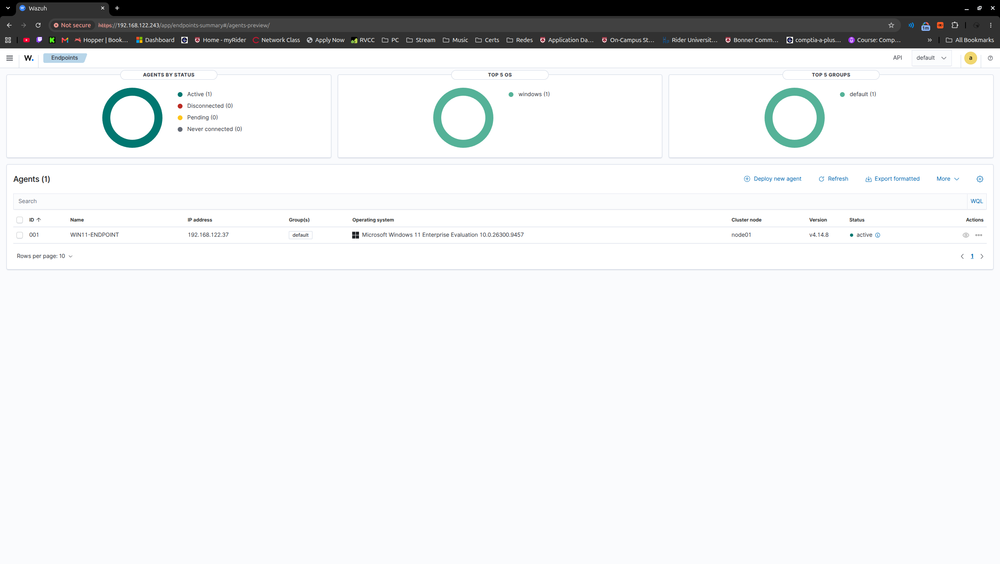

# Wazuh SOC Home Lab

**In progress — Windows agent connected and first alerts investigated; Sysmon and controlled detection exercises are next.**

After finishing my [Azure security lab](https://github.com/FloresFreddyGH/azure-security-lab), I wanted to build something I could keep experimenting with on my own computer. This is my next project: a local Wazuh lab where I plan to collect Windows events, investigate controlled activity, and write up what I actually find.

My Windows endpoint is now active in Wazuh, and I have started opening real event records to understand what triggered the alerts. My first investigation was a useful reminder to check my assumptions: I thought a startup-setting change might be the Wazuh service, but the records identified BITS and UCPD.

Getting here also meant troubleshooting Linux permissions, a broken snapshot filename, and copy and paste inside the Windows VM. I am keeping those parts in the journal too. They are part of what I am learning.

## What works so far

- KVM/QEMU and Virtual Machine Manager on my Ubuntu desktop.
- Ubuntu Server 24.04.5 LTS VM with 4 vCPUs, 8 GiB RAM, and an 80 GiB virtual disk.
- Default NAT networking and SSH access from the desktop.
- Package updates and a synchronized UTC clock checked before installing Wazuh.
- Wazuh manager, indexer, Filebeat, and dashboard started by the installation assistant.
- Successful browser login to the dashboard; admin password rotated and service health checked.
- Windows agent 4.14.8 enrolled as `WIN11-ENDPOINT`, ID `001`, with status **Active**.
- First inventory, configuration assessment, and vulnerability findings reviewed.
- Two Windows service-startup changes examined using their event details.
- Windows 11 Enterprise Evaluation endpoint installed with 4 vCPUs, 8 GiB RAM, an 80 GiB disk, UEFI, TPM 2.0, and default NAT networking.
- Windows endpoint received `192.168.122.37`; TCP connectivity to Wazuh ports 1514 and 1515 succeeded.
- A snapshot-related boot problem diagnosed and repaired without reinstalling Ubuntu.

The first endpoint assessment showed a 26% configuration benchmark score and 19 vulnerability findings associated with QEMU guest agent. These are findings to investigate, not proof of a compromise. My [first alert investigation](docs/first-alert-investigation.md) records what the BITS and UCPD events establish and what remains unknown.

## Lab setup

| Component | Configuration |
| --- | --- |
| Host | Ubuntu desktop, Intel Core i5-14400F, approximately 32 GB RAM |
| Hypervisor | KVM/QEMU with Virtual Machine Manager |
| Server | `wazuh-server`, Ubuntu Server 24.04.5 LTS |
| VM resources | 4 vCPUs, 8192 MiB RAM, 80 GiB virtual disk |
| Storage | ext4 root filesystem; no LVM in this installation |
| Network | libvirt default NAT; observed guest IP `192.168.122.243` via DHCP |
| Platform | Wazuh 4.14.8, all central components on one VM |
| Administration | SSH from the host; dashboard over HTTPS |
| Endpoint | Windows 11 Enterprise Evaluation VM, `labadmin`, observed IP `192.168.122.37`; Wazuh agent 4.14.8 active as `WIN11-ENDPOINT`; Sysmon still pending |

The address above belongs to my local lab and may change. The host and VM must be running for me to access the dashboard or connect over SSH.

## Next steps

- [x] Rotate the initial dashboard admin password and verify a new login.
- [x] Verify service health after reboot and document the result.
- [ ] Set up deliberate Wazuh package updates and SSH key authentication.
- [ ] Review snapshot metadata after the filename repair and test a recovery procedure before relying on it.
- [x] Create the Windows VM and verify connectivity to Wazuh ports 1514 and 1515.
- [x] Enroll its Wazuh agent and confirm Active status.
- [x] Review the first endpoint baseline and investigate two service-change records.
- [ ] Install Sysmon and verify that Windows events reach Wazuh.
- [ ] Investigate controlled failed logins, a harmless PowerShell script, and a harmless scheduled task.
- [ ] Write incident timelines, compare expected and unexpected activity, and verify cleanup.

## Notes and evidence

- [First alert investigation](docs/first-alert-investigation.md): BITS and UCPD startup-setting changes.
- [Lab journal](docs/lab-journal.md): what I did, what went wrong, and what I learned.
- [Setup notes](docs/setup-notes.md): commands and configuration recorded during the build.
- [Screenshot index](screenshots/README.md): evidence with captions and limits.
- [Portfolio summary](docs/portfolio-summary.md): a short description of the current milestone.

This repository contains documentation and screenshots. VM disks, installation ISOs, private keys, passwords, and installation credential archives stay out of Git.

## References and assistance

- [Wazuh quickstart](https://documentation.wazuh.com/current/quickstart.html)
- [Ubuntu virtualization documentation](https://documentation.ubuntu.com/server/how-to/virtualisation/)
- [Libvirt domain XML documentation](https://libvirt.org/formatdomain.html)

I use official documentation and AI assistance for explanations, troubleshooting, and organizing my notes. I perform the lab steps and keep the claims tied to the outputs and screenshots I have collected.
